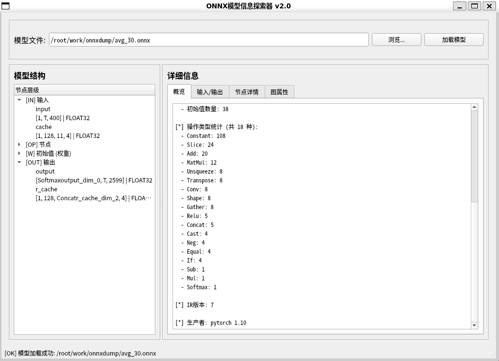

# ONNX Dump

一组用于查看和分析 ONNX 模型信息的工具。

## 功能特性

- **元信息查看**：模型名称、IR版本、Opset版本、生产者信息
- **自定义元数据**：显示、导出、导入模型中存储的 custom metadata
- **输入输出信息**：表格形式展示模型的所有输入和输出
- **算子统计**：统计模型中使用的所有算子类型及数量
- **参数量统计**：自动计算模型的参数总量

## 工具列表

### 1. onnx_dump.py（推荐）

漂亮的命令行工具，使用 rich 库输出彩色表格。

**依赖：**
```bash
pip install onnx rich
```

**使用：**
```bash
./onnx_dump.py model.onnx              # 查看基本信息
./onnx_dump.py model.onnx -w            # 显示权重信息
./onnx_dump.py model.onnx --no-ops      # 不显示算子信息
```

**输出示例：**


---

### 2. onnx_dump_simple.py

简单命令行工具，纯文本输出，无需额外依赖。

**依赖：**
```bash
pip install onnx
```

**使用：**
```bash
./onnx_dump_simple.py model.onnx          # 查看所有信息
./onnx_dump_simple.py model.onnx --no-ops # 不显示算子信息
```

---

### 3. onnx_viewer_gui.py

PyQt5 图形界面工具，提供交互式模型浏览。

**依赖：**
```bash
pip install onnx PyQt5
```

**使用：**
```bash
python onnx_viewer_gui.py
```

**功能：**
- 左侧树形结构展示模型层级
- 右侧标签页显示详细信息
  - 概览：模型元数据和统计
  - 输入/输出：表格形式
  - 节点详情：点击节点查看属性
  - 图属性：完整计算图信息

**界面截图：**



---

### 4. onnx_metadata.py

Custom Metadata 导出/导入工具。

**依赖：**
```bash
pip install onnx
```

**使用：**
```bash
# 导出 metadata 到文本文件
./onnx_metadata.py export model.onnx metadata.txt

# 导入 metadata（合并模式，保留原有但文件中没有的key）
./onnx_metadata.py import model.onnx metadata.txt new_model.onnx

# 导入 metadata（完全替换模式，删除所有原有metadata）
./onnx_metadata.py import model.onnx metadata.txt new_model.onnx --mode replace

# 列出模型的 metadata
./onnx_metadata.py list model.onnx
```

**metadata 文件格式：**
```
key1<TAB>value1
key2<TAB>value2
author	myname
version	1.0
```

## 安装

```bash
# 克隆仓库
git clone https://github.com/jimax2000/onnxdump.git
cd onnxdump

# 安装依赖
pip install -r requirements.txt
```

## 依赖

- Python 3.7+
- onnx

可选依赖：
- rich（用于漂亮的彩色输出）
- PyQt5（用于GUI界面）

## 示例

```bash
# 快速查看模型信息
./onnx_dump.py resnet50.onnx

# 查看带权重的详细信息
./onnx_dump.py model.onnx -w

# 使用GUI浏览器
python onnx_viewer_gui.py
```

## License

MIT
